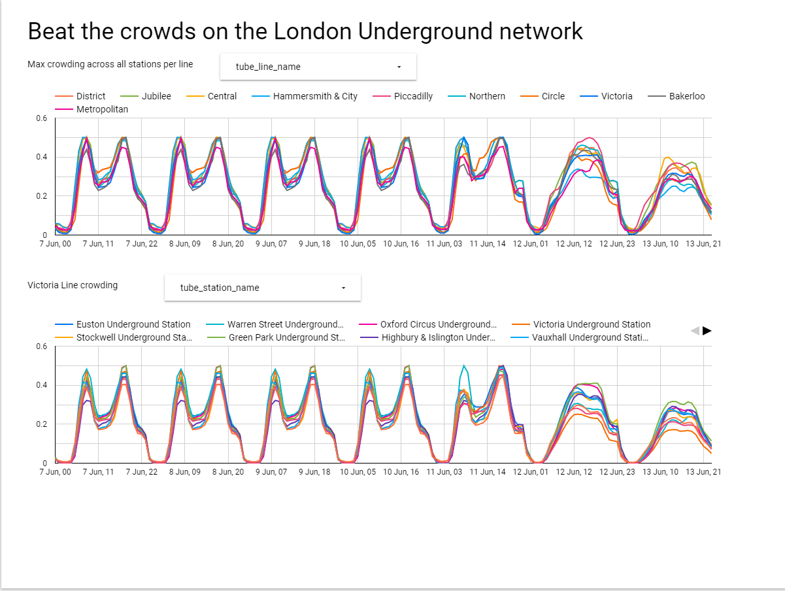

# Beat the crowds on the London underground network

## Avoid crowds on the London underground using data from the TFL API

For those of us that getting back on London public transport, crowds are no longer just uncomfortable they're also a potential health risk with the covid situation. 

TFL has released via its API daily average crowding data which has been used to visualize how crowded the London underground stations are at different times of day. 

You can access the dashboard here: https://bit.ly/3vIuR79

When fully loaded it should look like this: 

## How this works

1. Data is extracted as JSON from the TFL APIs. Care is taken to ensure it's in new line delimited JSON format. This is so that later on each line can be read into DataFlow as treated as a separate object to enable parrallel processes of the TFL crowding data.
2. The extracted data is stored on Cloud Storage, which acts as a data lake for this project.
3. BigQuery, actiing as the data warehouse for this project, has tables configured to house the cleaned up data
4. Dataflow pipeslines are used to
  *  Extract JSON from cloud stroage
  *  Transform the data in the JSON objects into the schema needed
  *  Load the cleaned data into the BigQuery tables from #3 
5. A DataStudio dashboard was created to read the newly created BigQuery tables