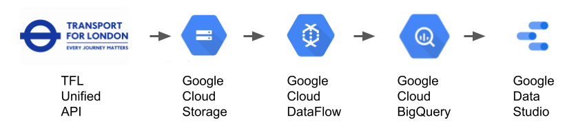

# Beat the crowds on the London underground network

## Using data from the TFL API to understand when crowds are likely to occur

For those of us that getting back on London public transport, crowds are no longer just uncomfortable they're also a potential health risk given covid.

Government advice is to avoid peak times, but it wasn't clear what this actually meant for my specific commute and travel plans. 

There is now a need for crowding data when planning a journey in London & this project aims to help by providing data on:

  * where crowding occurs, so you can find information specific to your commute or trip
  * when crowding occurs, so you can adjust your commute or trip to avoid the actual peak on a given day. 

To help with this, TFL has released via its API daily average crowding data which has been used to visualize how crowded each London underground station is at different times of day. 

## Access the dashboard

You can access the dashboard here: https://bit.ly/3vIuR79

When fully loaded it should look like this: 

## How this works

1. Data is extracted as JSON from the TFL Unified APIs

    * Care is taken to ensure it's in new line delimited JSON format. This is so that later on each line can be read into DataFlow as treated as a separate object to enable parrallel processes of the TFL crowding data.
2. The extracted data is stored on Cloud Storage, which acts as a data lake for this project.
3. BigQuery, acting as the data warehouse for this project, has tables configured to house the cleaned up data
4. Dataflow pipelines are used to

    *  Extract JSON from cloud stroage
    *  Transform the data in the JSON objects into the schema needed
    *  Load the cleaned data into the BigQuery tables from #3 

5. A DataStudio dashboard was created to read the newly created BigQuery tables

    *  The TFL API provided crowding measurements every 15 mins, but this volume of data was too much for DataStudio to handle.
    *  A custom query was written in BigQuery to truncate the original dataset down to a single measurement every hour. Through this the final data set was reduced to the point where DataStudio could handle it whilst still giving the needed insights to users.